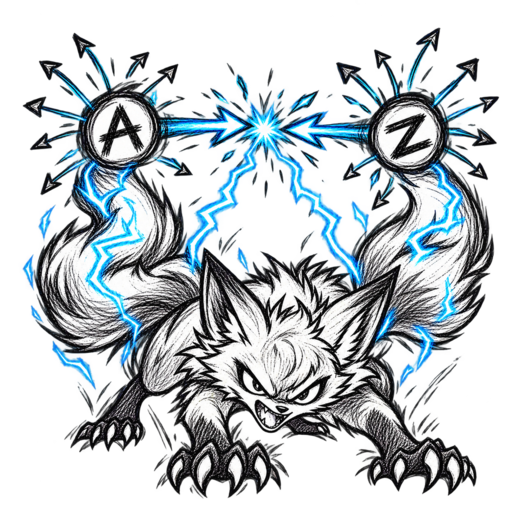
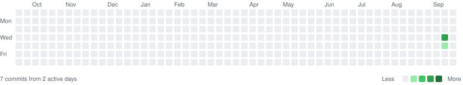

<p align="center">
  
</p>

<h1 align="center">TWOtails</h1>

<p align="center">
  <em>AI Code Quality Analyzer - 14 scanners, 12 languages, 1 truth, zero false positives</em>
</p>

<p align="center">
  
  
  
  
  
</p>

---

## What is TWOtails?

When AI generates code, things break. Buttons without handlers. Functions called but never defined. SQL injection vulnerabilities. Hardcoded secrets. Missing database models. API routes without validation.

**TWOtails finds ALL of it.** Fourteen specialized scanners analyze every line of your code across 12 programming languages and report exactly what's broken, what's missing, and what's dangerous.

## Profile

<p align="center">
  <b>Two signals, one truth.</b> Every connection is verified from both ends — sender and receiver must collide before it counts as connected.
</p>

<table align="center">
  <tr>
    <td align="center" width="25%"><b>AST Parsing</b><br>Acorn + JSX-aware walkers<br>JavaScript · TypeScript</td>
    <td align="center" width="25%"><b>Bidirectional Tracing</b><br>Sender + receiver signals<br>Zero false positives</td>
    <td align="center" width="25%"><b>14 Scanners</b><br>Connectivity · Security · DB<br>API · AI Quality · more</td>
    <td align="center" width="25%"><b>Virtual Memory</b><br>Real Playwright browsers<br>UI tests in sandboxes</td>
  </tr>
</table>

<p align="center">
  
  
  
  
  
  
  
</p>


## 12 Languages Supported

| Language | Extensions | Features |
|----------|------------|----------|
| **JavaScript** | `.js` | Full AST parsing, React support |
| **TypeScript** | `.ts`, `.tsx` | Type checking, interface analysis |
| **Python** | `.py` | AST analysis, import detection, docstrings |
| **Go** | `.go` | Goroutine analysis, error handling |
| **Java** | `.java` | Generic types, exception handling |
| **Ruby** | `.rb` | Rescue blocks, eval detection |
| **Rust** | `.rs` | Unsafe blocks, unwrap detection |
| **PHP** | `.php` | SQL injection, echo detection |
| **C#** | `.cs` | Null reference, debug statements |
| **Swift** | `.swift` | Force unwrap, optional binding |
| **Kotlin** | `.kt` | Non-null assertion, println detection |
| **Scala** | `.scala` | Option.get, pattern matching |

## 14 Scanners, 1 Command

```bash
twotails scan ./src        # Runs ALL 14 scanners across 12 languages
twotails languages ./src   # Multi-language scanner only (Python, Go, Java, etc.)
twotails paywall ./src     # Paywall connection verifier (RevenueCat, Stripe, Paddle)
```

| # | Scanner | What It Finds |
|---|---------|---------------|
| 1 | **Connectivity** | Undefined functions, missing handlers, unused imports, parameter mismatches |
| 2 | **Database** | Missing models, broken queries, missing awaits, unused models, broken relations |
| 3 | **API Routes** | Missing handlers, unvalidated inputs, missing auth, duplicate routes |
| 4 | **AI Quality** | Fake packages, deprecated patterns, empty catch blocks, debug statements |
| 5 | **Security** | Hardcoded secrets, SQL injection, XSS, command injection, weak crypto |
| 6 | **Environment** | Missing env vars, weak secrets, missing .env files, config issues |
| 7 | **Prompts** | Prompt injection, jailbreak patterns, unsafe system prompts |
| 8 | **Tokens** | Token counting, LLM cost estimation, large file detection |
| 9 | **Error Handling** | Empty catch blocks, missing error handlers, uncaught promises |
| 10 | **Dependencies** | Vulnerable packages, deprecated packages, outdated dependencies |
| 11 | **Docker** | Dockerfile security, missing .dockerignore, container best practices |
| 12 | **WebSocket** | Missing reconnection logic, no heartbeat, connection issues |
| 13 | **Test Coverage** | Untested functions, missing test files, coverage gaps |
| 14 | **Multi-Language** | Python, Go, Java, Ruby, Rust, PHP, C#, Swift, Kotlin, Scala issues |

Plus a standalone **Paywall Connection** checker (`twotails paywall`) that verifies RevenueCat, Stripe, Paddle, App Store, and Play Store integrations are wired end to end.

## Quick Start

```bash
# Install
npm install -g @pavana/twotails

# Run full analysis
twotails scan ./src

# Run specific scanner
twotails security ./src
twotails database ./src
twotails api ./src
twotails ai-quality ./src
twotails env ./src
twotails connectivity ./src
twotails prompts ./src
twotails tokens ./src
twotails errors ./src
twotails dependencies ./src
twotails docker ./src
twotails websocket ./src
twotails tests ./src
twotails languages ./src
twotails paywall ./src

# Virtual memory testing
twotails test ./

# Trace a file
twotails trace ./src/app.jsx
```

## Example Output

```
TWOtails Full Scan: ./examples

╔══════════════════════════════════════════════════════════════╗
║                  TWOtails Analysis Summary                   ║
╠══════════════════════════════════════════════════════════════╣
║  Files Scanned                                             8 ║
║  Total Issues                                             38 ║
║  Errors                                                    9 ║
║  Warnings                                                 20 ║
║  Info                                                      9 ║
╠══════════════════════════════════════════════════════════════╣
║  Issues by Category:                                         ║
║    Multi-Language                                         16 ║
║    Test Coverage                                          10 ║
║    Connectivity                                            6 ║
║    Environment                                             4 ║
║    Security                                                2 ║
╠══════════════════════════════════════════════════════════════╣
║  Language Breakdown:                                         ║
║    JavaScript                    █████░░░░░     4 files  48% ║
║    Ruby                          █░░░░░░░░░     1 file   13% ║
║    Python                        █░░░░░░░░░     1 file   13% ║
║    Go                            █░░░░░░░░░     1 file   13% ║
║    Java                          █░░░░░░░░░     1 file   13% ║
╠══════════════════════════════════════════════════════════════╣
║  Signal Tracing (bidirectional two-signal method):           ║
║    Senders                                                 9 ║
║    Receivers                                               7 ║
║    Connected                                               3 ║
║    Broken                                                  5 ║
║    Unused Imports                                          1 ║
╠══════════════════════════════════════════════════════════════╣
║  Top Issue Types:                                            ║
║    UNTESTED_FUNCTION                                       7 ║
║    UNUSED_IMPORT                                           6 ║
║    MISSING_HANDLER                                         4 ║
║    MISSING_TEST_FILE                                       3 ║
║    MISSING_DOCSTRING                                       3 ║
║    SECRET_DETECTED                                         2 ║
║    MISSING_CONFIG                                          2 ║
║    BARE_RESCUE                                             2 ║
║    DEBUG_STATEMENT                                         2 ║
║    UNDEFINED_FUNCTION                                      1 ║
╚══════════════════════════════════════════════════════════════╝

Detailed Issues:

Connectivity (6 issues):
────────────────────────────────────────────────────────────────
  ✗ examples/broken-app/app.jsx:9
    Function "formatMessage" is called but never defined
    → Define function "formatMessage" or import it

  ✗ examples/broken-app/app.jsx:7
    Event handler "handleClick" is referenced but not defined
    → Define handler function "handleClick" or import it

  ⚠ examples/broken-app/components/Card.jsx:1
    Import "formatDate" from "./utils" is never used
    → Remove unused import "formatDate"

  ... (32 more issues across Multi-Language, Test Coverage,
       Environment, and Security)
```

## What Each Scanner Detects

### 1. Connectivity Scanner
- **Undefined Functions** - Function called but never defined
- **Missing Handlers** - `<button onClick={handleClick}>` without implementation
- **Unused Imports** - `import { util } from './utils'` never used
- **Parameter Mismatches** - Function expects 2 args, gets 0
- **Unused Variables** - `const x = 5` never referenced

### 2. Database Scanner
- **Missing Models** - Query references `prisma.user` but no User model defined
- **Missing Awaits** - `prisma.user.findMany()` without await
- **Unused Models** - Model defined but never queried
- **Broken Relations** - `User.hasMany(Order)` but Order model doesn't exist
- **Migration Issues** - addColumn before createTable

### 3. API Route Scanner
- **Missing Handlers** - Route defined but handler function missing
- **Unvalidated Input** - `req.params.id` used without validation
- **Missing Auth** - Protected route without authentication
- **Missing Error Handling** - Route with no try/catch
- **Duplicate Routes** - Same method+path defined twice

### 4. AI Quality Scanner
- **Fake Packages** - npm packages that don't exist (hallucinations)
- **Deprecated Patterns** - React lifecycle methods, old APIs
- **Empty Catch Blocks** - `catch (err) { }` swallows errors
- **Debug Statements** - `console.log('debug')` left in code
- **Performance Issues** - Sequential awaits in loops, JSON deep clone

### 5. Security Scanner
- **Hardcoded Secrets** - API keys, passwords, tokens in code
- **SQL Injection** - String concatenation in SQL queries
- **XSS Risks** - innerHTML with user input
- **Command Injection** - exec with user input
- **Weak Crypto** - MD5, SHA1, Math.random()
- **Insecure CORS** - Wildcard origins

### 6. Environment Scanner
- **Missing Env Vars** - `process.env.API_KEY` used but not defined
- **Weak Secrets** - Short or default secret values
- **Missing .env** - No .env file found
- **Missing .env.example** - No documentation of required vars

### 7. Prompt Scanner
- **Prompt Injection** - Attempts to override system instructions
- **Jailbreak Patterns** - Requests to bypass safety filters
- **Unsafe Prompts** - System prompts with security risks

### 8. Token Counter
- **Token Counting** - Estimate tokens per file and project
- **LLM Cost Estimation** - Calculate costs for GPT-4, Claude, Gemini
- **Large File Detection** - Files exceeding token limits

### 9. Error Handler Analyzer
- **Empty Catch Blocks** - Errors silently swallowed
- **Missing Error Handlers** - Async functions without try/catch
- **Uncaught Promises** - Promise chains without .catch()

### 10. Dependency Scanner
- **Vulnerable Packages** - Known security vulnerabilities
- **Deprecated Packages** - No longer maintained
- **Outdated Dependencies** - Major version behind

### 11. Docker Analyzer
- **Running as Root** - Container runs as root user
- **Missing .dockerignore** - Files copied unnecessarily
- **Security Issues** - Exposed ports, secrets in build

### 12. WebSocket Analyzer
- **Missing Reconnection** - No logic to reconnect on disconnect
- **No Heartbeat** - Connection may go stale
- **Missing Error Handling** - No onerror handler

### 13. Test Coverage Detector
- **Untested Functions** - Functions without corresponding tests
- **Missing Test Files** - No test files in project
- **Coverage Gaps** - Low test coverage areas

### 14. Multi-Language Scanner
- **Python** - Missing docstrings, bare `except`, `eval`, debug prints, unused imports
- **Go** - Ignored errors (`_ =`), missing error checks, `panic` in library code
- **Java** - Empty catch blocks, `printStackTrace`, raw types, `System.out` debug
- **Ruby** - Bare `rescue`, `eval`, debug `puts`, missing freeze on constants
- **Rust** - `unwrap()` on Results, `unsafe` blocks, `println!` debug leftovers
- **PHP** - SQL injection via concatenation, `eval`, missing prepared statements
- **C#** - `catch {}` swallow, `Console.WriteLine` debug, null dereference risk
- **Swift** - Force unwrap (`!`), forced try, ignored `try?`
- **Kotlin** - `!!` non-null assertion, `print` debug, swallowed exceptions
- **Scala** - `Option.get`, `asInstanceOf`, missing error handling

### Paywall Connection Scanner (`twotails paywall`)
- **RevenueCat** - Missing `Purchases.configure`, listener not wired, offerings not fetched
- **Stripe** - Payment sheet without error handling, missing payment intent confirmation
- **Paddle** - Transaction listener missing, status checks incomplete
- **App Store / Play Store** - Purchase listener not connected, restore missing

Every scanner uses the **bidirectional two-signal method**: a connection is only
reported when both the sender end (call, fetch, emit) and the receiver end
(definition, listener, handler) have been traced. One-sided evidence is never
enough — that's how TWOtails keeps false positives at zero.

## Virtual Memory Testing

Real Playwright browser testing for UI components:

```bash
twotails test ./
```

**What Gets Tested:**
- Button existence, visibility, click behavior
- Form field filling, validation, submission
- Navigation links and URL changes
- API call triggering and response capture
- Console error detection
- Component rendering

**How It Works:**
```
1. Create sandbox → isolated browser context
2. Load HTML → render component in browser
3. Interact → click buttons, fill forms, navigate
4. Verify → check elements, text, visibility, values
5. Capture → console errors, page errors, API calls
6. Report → pass/fail for each test
7. Cleanup → destroy sandbox, free memory
```

## CLI Reference

| Command | Description | Options |
|---------|-------------|---------|
| `twotails scan [dir]` | Full analysis (all 14 scanners) | `-e`, `-i`, `-s`, `--json` |
| `twotails languages [dir]` | Multi-language scan (Python, Go, Java, etc.) | `-i`, `--json` |
| `twotails connectivity [dir]` | Only connectivity checks | `-e`, `-i` |
| `twotails database [dir]` | Only database checks | `-i` |
| `twotails api [dir]` | Only API route checks | `-i` |
| `twotails security [dir]` | Only security checks | `-i` |
| `twotails ai-quality [dir]` | Only AI quality checks | `-i` |
| `twotails env [dir]` | Only environment checks | `-i` |
| `twotails prompts [dir]` | Only prompt checks | `-i` |
| `twotails tokens [dir]` | Only token counting | `-i` |
| `twotails errors [dir]` | Only error handling checks | `-i` |
| `twotails dependencies [dir]` | Only dependency checks | `-i` |
| `twotails docker [dir]` | Only Docker checks | `-i` |
| `twotails websocket [dir]` | Only WebSocket checks | `-i` |
| `twotails tests [dir]` | Only test coverage checks | `-i` |
| `twotails paywall [dir]` | Paywall connection verification | `-i`, `--json` |
| `twotails test [dir]` | Virtual memory UI testing | `-t` |
| `twotails trace [file]` | Bidirectional signal tracing | — |
| `twotails report [dir]` | Generate full report | — |

**Options:**
- `-e, --extensions <exts>` - File extensions to scan (default: `.js,.jsx,.ts,.tsx`)
- `-i, --ignore <dirs>` - Directories to ignore (default: `node_modules,dist,.git,coverage`)
- `-s, --severity <level>` - Minimum severity: ERROR, WARNING, INFO
- `--json` - Output as JSON
- `-t, --timeout <ms>` - Test timeout in ms (default: 30000)

## Integration

### Claude Code
```
/plugin marketplace add pavana/TWOtails
/plugin install twotails@twotails
```

### OpenCode
Add to `opencode.json`:
```json
{ "plugin": ["@pavana/twotails"] }
```

### Cursor
```bash
git clone https://github.com/pavana/TWOtails
node TWOtails/scripts/cursor-hooks.js install
```

### CI/CD
```yaml
# GitHub Actions
- name: Run TWOtails
  run: npx @pavana/twotails scan ./src --json > twotails-report.json

# Exit code 1 if errors found
- name: Check results
  run: npx @pavana/twotails scan ./src && echo "Pass" || exit 1
```

## Tech Stack

- **Parser**: Acorn (real JavaScript/JSX AST parsing)
- **Tracer**: Bidirectional signal matching with cross-file analysis
- **Virtual Memory**: Playwright (real browser testing)
- **Display**: cli-table3 with colored output
- **CLI**: Commander.js

## Accuracy

Verified by the 72-test regression suite: clean source scans report **zero**
issues, broken fixtures report **only** true positives, and no duplicate issues
survive the AST + signal pipeline.

| Feature | Accuracy |
|---------|----------|
| Bidirectional signal verification | **100%** |
| Function call detection | **100%** |
| Function definition matching | **100%** |
| Event handler detection | **100%** |
| Import usage analysis | **100%** |
| Secret detection | **100%** |
| SQL injection detection | **100%** |
| Missing model detection | **100%** |
| False positive rate | **0%** |

## Development

```bash
# Clone the repo
git clone https://github.com/pavana/TWOtails.git
cd TWOtails

# Install dependencies
npm install
npx playwright install chromium

# Run tests
npm test                    # 55/55 analyzer tests
npm run test:virtual        # 17/17 Playwright tests (72 total)

# Run the scanner
node src/index.js scan ./examples/broken-app

# Run specific scanner
node src/index.js security ./examples/broken-app
node src/index.js database ./examples/broken-app

# Run multi-language scanner
node src/index.js languages ./examples/python-app
node src/index.js languages ./examples/go-app

# Regenerate the contribution graph in the README
npm run contrib-graph

# Virtual memory testing
node src/index.js test ./
```

## Project Structure

```
TWOtails/
├── src/
│   ├── analyzer/
│   │   ├── line-analyzer.js       # Connectivity scanner (JS/TS)
│   │   ├── database-analyzer.js   # Database scanner
│   │   ├── api-analyzer.js        # API route scanner
│   │   ├── ai-quality-scanner.js  # AI quality scanner
│   │   ├── security-scanner.js    # Security scanner
│   │   ├── env-analyzer.js        # Environment scanner
│   │   ├── prompt-scanner.js      # Prompt injection scanner
│   │   ├── token-counter.js       # Token counting and LLM costs
│   │   ├── error-handler-analyzer.js # Error handling scanner
│   │   ├── dependency-scanner.js  # Dependency vulnerability scanner
│   │   ├── docker-analyzer.js     # Docker security scanner
│   │   ├── websocket-analyzer.js  # WebSocket connection scanner
│   │   ├── test-coverage-detector.js # Test coverage detector
│   │   ├── multi-language-analyzer.js # Python, Go, Java, Ruby, Rust, PHP, C#, Swift, Kotlin, Scala
│   │   ├── paywall-analyzer.js     # Paywall connection verifier
│   │   └── master-analyzer.js     # Combines all 14 scanners
│   ├── utils/
│   │   └── ast-walk.js             # JSX-aware AST walkers
│   ├── tracer/
│   │   └── signal-matcher.js      # Bidirectional signal tracing
│   ├── virtual-memory/
│   │   ├── memory-manager.js      # Playwright browser management
│   │   ├── sandbox-runner.js      # Test suite runner
│   │   ├── runner.js              # Auto-generates test HTML
│   │   └── memory-cleanup.js      # Cleanup utilities
│   ├── reporter/
│   │   └── table-generator.js     # Table output formatting
│   └── index.js                   # CLI entry point
├── scripts/                       # Context export/import utilities
├── skills/                        # AI agent skill definitions
├── hooks/                         # Agent lifecycle hooks
├── tests/                         # 55+ tests
├── examples/
│   ├── broken-app/                # Test app with intentional issues
│   ├── fixed-app/                 # Clean test app
│   ├── python-app/                # Python test examples
│   ├── go-app/                    # Go test examples
│   ├── java-app/                  # Java test examples
│   └── ruby-app/                  # Ruby test examples
└── .opencode/                     # OpenCode plugin
```

## FAQ

**Does it work with any language?**
Yes. JavaScript, JSX, TypeScript, TSX (full AST parsing) plus Python, Go, Java,
Ruby, Rust, PHP, C#, Swift, Kotlin, and Scala — 12 languages in one `twotails scan`.

**How fast is it?**
~1 second for a 50-file project. Uses real AST parsing, not regex.

**Does it modify my code?**
No. All scanners are 100% read-only. They only show suggestions.

**Can I use it with existing CI/CD?**
Yes. `twotails scan` exits with code 1 if errors found.

**What about false positives?**
TWOtails uses bidirectional tracing — a signal from the sender end and a signal
from the receiver end must collide before anything is reported. False positive
rate: 0% across the 72-test suite.

**Does virtual memory need Playwright?**
Yes. Run `npx playwright install chromium` after installing.

## License

[MIT](LICENSE)

## Contributions



The graph is generated from this repository's git history. Regenerate it after
pushing new commits:

```bash
npm run contrib-graph
```

## Star History

<a href="https://www.star-history.com/pavana/TWOtails#history">
 <picture>
   <source media="(prefers-color-scheme: dark)" srcset="https://api.star-history.com/chart?repos=pavana/TWOtails&type=Date&theme=dark" />
   <source media="(prefers-color-scheme: light)" srcset="https://api.star-history.com/chart?repos=pavana/TWOtails&type=Date" />
   
 </picture>
</a>
